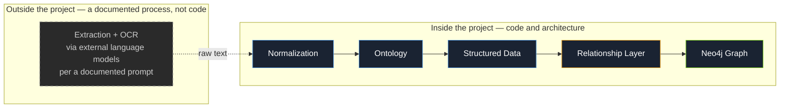
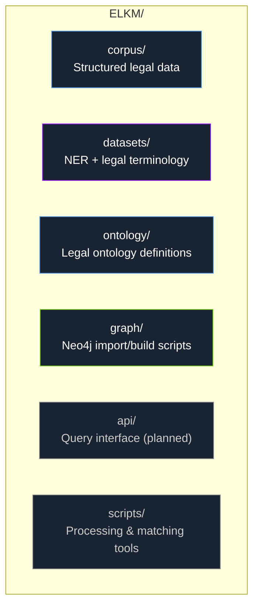
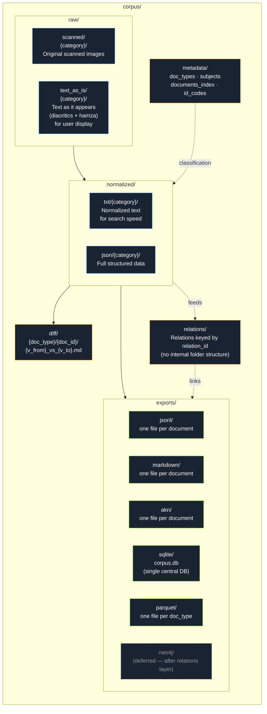
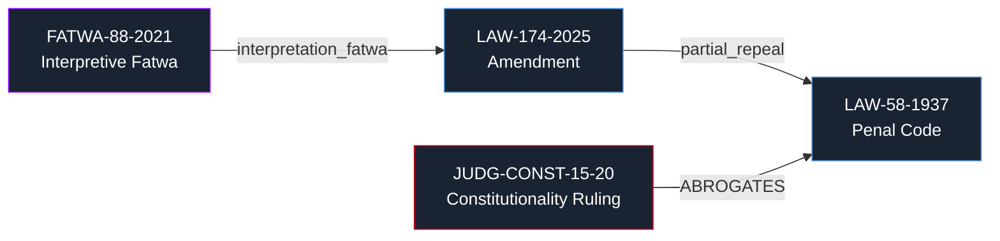

<div align="center">

# ELKM — Egyptian Legal Knowledge Model

**The first comprehensive, open-source Arabic legal knowledge graph for Egyptian law**

[](https://opensource.org/licenses/MIT)
[](https://creativecommons.org/licenses/by/4.0/)
[](https://www.python.org/)
[](https://neo4j.com/)
[]()
[](https://heshammalek.github.io/ELKM/)
[](https://github.com/heshammalek/ELKM-Egyptian-Legal-Knowledge-Model/actions)

**[نسخة عربية متاحة في `docs/README.ar.md`](docs/README.ar.md)**

</div>

---

## 📑 Table of Contents

- [Why ELKM?](#why-elkm)
- [Quick Start](#-quick-start-tldr)
- [Core Challenges](#core-challenges)
- [The Academic Gap](#the-academic-gap)
- [Why ELKM Is Different](#why-elkm-is-different-competitive-context)
- [Project Scope](#project-scope-where-the-code-ends)
- [Repository Structure](#repository-structure)
- [Corpus Structure](#corpus-structure-corpus)
- [Relationship Graph](#relationship-graph)
- [Segmented Identifier System](#segmented-identifier-system)
- [Technical Stack](#technical-stack)
- [Inspired By](#inspired-by)
- [Current Status](#-current-status)
- [Roadmap](#roadmap)
- [How to Contribute](#-how-to-contribute)
- [Call for Collaboration](#call-for-collaboration)
- [Acknowledgments](#-acknowledgments)
- [License](#license)

---

## Why ELKM?

Egyptian legal text is **hyper-precision**: a single letter can redefine criminal liability. The passive *"يُعاقَب"* (liability falls on whoever is proven to have caused the harm) is not the same statement as the active *"يُعاقِب"* (an explicit actor is named) — one character, an entirely different legal consequence. Text alone doesn't represent legal truth, either: truth emerges from the text's interaction with the Constitutional Court (annulment), the Court of Cassation (binding interpretation), and the State Council (fatwa and annulment). Current legal search tools treat all of this as keyword matching.

ELKM solves this by treating Egyptian law not as a text archive, but as a **knowledge graph** — a relationship network connecting every text to everything that affected it or was affected by it, with full historical tracking of each article's status individually.

---

## 🚀 Quick Start (TL;DR)

```bash
# Clone the repo
git clone https://github.com/heshammalek/ELKM-Egyptian-Legal-Knowledge-Model.git
cd ELKM-Egyptian-Legal-Knowledge-Model

# Set up Python environment
python -m venv venv
source venv/bin/activate  # On Windows: venv\Scripts\activate
pip install -r requirements.txt

# Run the corpus build pipeline
python scripts/build_corpus.py
```

> The unified export/build script is still under active development (see [Current Status](#-current-status)) — exact commands and paths will stabilize as `scripts/` is finalized. For detailed setup, see the [Installation Guide](https://heshammalek.github.io/ELKM/installation/).

---

## Core Challenges

| # | Challenge | Detail |
|---|-----------|--------|
| 1 | **No unified relational structure** | Egyptian laws interweave through total/partial repeal, amendment, addition, and delegation — with no structured, programmatically queryable source linking them |
| 2 | **Overlapping document types** | Laws, decree-laws, administrative decisions, legislative fatwas, judicial rulings, parliamentary minutes — each with different force logic, statuses, and issuing authorities, and easy to misclassify (e.g. every decree-law is titled "Presidential Decision," but not every presidential decision is a decree-law) |
| 3 | **Arabic legal-text complexity** | Diacritics, hamza variants, Arabic-Indic vs. Western numerals, legal tables — and hyper-precision at the character level, as in the passive/active distinction above |
| 4 | **The temporal dimension of force** | The same article can be in force, then suspended, then amended, then ruled unconstitutional — each state with its own independent start and end date, requiring precise tracking rather than a single snapshot |
| 5 | **Repeal vs. nullity vs. lapse** | Ending a text's effect doesn't always follow the same logic: prospective repeal, retroactive erasure, nullity from a fundamental defect, or automatic lapse (a decree-law not submitted to parliament within the constitutional deadline) — distinctions most legal archives ignore entirely |
| 6 | **Massive scale, scattered sources** | Thousands of documents spanning decades, from fragmented paper and digital sources, requiring a scalable data architecture instead of unstructured manual processing |
| 7 | **Colliding issuing authorities** | Entirely different administrative decisions can share the same number and year if issued by different authorities (a minister vs. a governor vs. an agency head) — without a structured authority registry, identifier collisions are inevitable |

---

## The Academic Gap

No comprehensive, publicly published Arabic legal ontology currently exists. Existing efforts are limited to digital legal dictionaries (term lists without relationships), incomplete research papers never implemented in software, or Western ontologies (FOLaw, LKIF, UFO-L) that don't map onto the Egyptian system.

**ELKM-Ontology** aims to be the first comprehensive, publicly published Arabic legal ontology — a scholarly contribution in its own right, publishable at venues such as **ICAIL** (International Conference on AI and Law), **JURIX**, and **LREC**. Concretely, ELKM aims to contribute:

1. The first comprehensive Arabic legal ontology.
2. A model for representing Arabic legal text as a knowledge graph.
3. An EBNF grammar for Arabic legal syntax — currently non-existent anywhere.
4. A bridge between global standards (Akoma Ntoso, LegalRuleML) and the Arabic legal context.
5. An Arabic legal Named Entity Recognition (NER) model.

### Why Egypt Specifically

The Egyptian legal system is a unique hybrid unlike any single reference model:

- **Islamic Sharia** — a principal source of legislation (Article 2 of the Constitution)
- **French civil law tradition** — underlying the civil and commercial fabric
- **Judicial precedent** — the Court of Cassation plays a broader interpretive role than its French counterpart
- **State Council fatwa** — a purely Egyptian institution with no Western equivalent
- **The Supreme Constitutional Court** — exercising posterior review of legislative constitutionality

Any off-the-shelf Western ontology collides with this specificity. The only viable path is a purpose-built one.

---

## Why ELKM Is Different (Competitive Context)

Products already exist offering fast full-text search over Egyptian legislation — most notably **Ansvar Systems** (Sweden), a globally leading company running the same MCP-server template across 80+ countries (SQLite + FTS5). The real difference isn't coverage — it's the **layer**:

| | Traditional full-text search tools | ELKM |
|---|---|---|
| Structure | Simple text indexing | Ontology + graph + explicit relationships |
| Depth | Generic classification, no fine-grained typing | Distinguishes decree-law from administrative decision, fatwa binding basis (Art. 66), per-article status over time |
| Scope | Usually statutes only | 13 document types (including rulings, fatwas, minutes, academic doctrine) |
| Nature | Repeatable technical template across dozens of countries (breadth) | A deep research project dedicated to the Egyptian legal system specifically (depth) |

ELKM aims to intellectually and technically surpass this model — not by competing on the same layer, but by building a deeper one (legal reasoning and a relationship graph) for which no real equivalent currently exists for Egyptian law. Tools like Harvey AI and CoCounsel demonstrate the same lesson from the other direction: powerful LLMs still need a structured knowledge base underneath them to reason reliably over law. ELKM aims to be that base — an open Egyptian equivalent of what Westlaw provides commercially, but published.

---

## Project Scope: Where the Code Ends

The **extraction and OCR** stage (converting image/PDF to text) runs through external language models following a documented extraction prompt, **entirely outside the project's codebase**. This is deliberate: ELKM's real value lies in the data architecture, ontology, relationship layer, and graph engine — not in an OCR engine that's replaceable by any newer model. Keeping extraction separate keeps the repo focused, lightweight on dependencies, and clear in scope for any contributor or reviewer.



---

## Repository Structure



### `datasets/ner/` — Detailed Layout

```
datasets/ner/
├── readme.md
├── schema.json              Label definitions: LAW_REF, ARTICLE_REF, COURT,
│                             AUTHORITY, DATE_HIJRI_GREGORIAN, PENALTY,
│                             MONETARY_AMOUNT, LEGAL_PERSON
├── annotated/
│   ├── train.conll           80%
│   ├── dev.conll             10%
│   └── test.conll            10%
├── exports/
│   ├── ner.jsonl              HuggingFace format
│   └── ner.conll
└── legal-terms/               Legal terminology glossary for annotation
                                consistency (e.g. relative vs. absolute
                                nullity, civil vs. criminal effect of an
                                unconstitutionality ruling, imprisonment
                                vs. detention vs. hard labor) — a
                                disambiguation reference for annotators,
                                not general documentation, to prevent
                                inconsistent labeling across the dataset
```

The `NER_EXTRACTOR` and `ANNOTATION_HELPER` scripts read directly from `corpus/normalized/{type}/json` — never re-reading raw scans, to avoid duplicated work. Until a trained model exists, the MVP fallback is a set of regex rules grounded in a documented Arabic legal-drafting grammar (conditional sentences, cross-references, definitions, enumerations, issuing-authority attribution).

**ArabicLegalNLP** — a standalone sibling Python library for Arabic legal NLP (legal thesaurus, morphological analysis, agent/patient extraction, NER), called by ELKM as an external tool rather than built into it. It exists to defend Arabic linguistic specificity in the legal domain, developed as its own project on its own timeline.

---

## Corpus Structure (`corpus/`)



**Design rationale:**

- **`raw/scanned/{category}/`** and **`raw/text_as_is/{category}/`**: a unified category split that repeats identically inside `normalized/` — knowing a document's path in one folder tells you its path everywhere else instantly.
- **`text_as_is`** is a verbatim copy (the *Display Path*) for direct user display; **`normalized`** is a simplified copy (the *Search Path*) for **faster search and matching**, not display.
- **`metadata`**: near-static classification data — document types, subject sectors, the document index, and the authority/court code registry (`id_codes.json`).
- **`relations`**: deliberately flat — every relation has a unique `relation_id` referenced directly from within the documents it connects, since relations overlap and aren't exclusive to a single party.
- **`diff/`**: textual comparison between two versions of the same document, built on the `version_from`/`version_to` fields already present in each document's JSON.
- **`exports/`**: a fully derived layer with storage granularity that differs by format — **jsonl/markdown/akn** one file per document, **sqlite** a single central database (`INSERT OR REPLACE` keyed by `doc_id` to prevent duplication), **parquet** one file per `doc_type` (a columnar format unsuited to thousands of small files), and **neo4j** deferred until the relationship layer is complete, since — unlike the others — it isn't a direct export but requires the ontology to be finished first.

### Article Index = the SQLite Export, Not a Separate File

With thousands of documents and hundreds of thousands of articles, a single `documents_index.json` becomes too heavy for article-level queries. The fix: an `articles_index` table inside the same SQLite export serves both purposes:

```sql
CREATE TABLE articles_index (
  doc_id TEXT, article_number INTEGER, doc_type TEXT,
  article_status TEXT, judgment_ref TEXT, subjects TEXT, -- JSON array as text
  text_normalized TEXT
);
```

This is the direct foundation for queries like *"which articles reference Article 53 of the constitution"* as a single query, and it's the same foundation the future Dependency Map will be built on.

---

## Relationship Graph



Every relation is recorded with full temporal and legal precision: relation type, effective date, extraction confidence level, and the relation's own status. This distinguishes **prospective repeal** from **retroactive erasure** from **nullity** — distinctions most traditional legal archives ignore entirely.

Named relation types anchor the graph's semantics, mirroring the authorities that create legal truth:

| Relation | Meaning |
|---|---|
| `DERIVED_FROM` | A regulation is derived from its enabling law |
| `IMPLEMENTS` | A law implements a constitutional provision |
| `MUST_NOT_CONTRADICT` | A ministerial decision must not contradict its parent regulation/law |
| `ABROGATES` | The Supreme Constitutional Court strikes down a provision |
| `INTERPRETS` / `CLARIFIES` | The Court of Cassation issues a binding interpretation (`Ascertained_Meaning`) |
| `ANNULS` | The Supreme Administrative Court annuls an administrative decision |

**Time-Travel queries** — retrieving the law exactly as it stood on a specific historical date — are a first-class capability the graph is designed to support, not an afterthought.

**Dependency Map** — *"which laws cite Article 53 of the constitution?"* — isn't a separate component, but a direct result of applying the NER model (specifically the `ARTICLE_REF` label) across the entire corpus to extract every explicit reference to one article inside another document's text, then building the graph from it.

---

## Segmented Identifier System

Every document gets a unique, human-readable, automatically generable identifier:

```
LAW-10-2000                     Law No. 10 of 2000
DECREE-LAW-20-2001              Decree-Law No. 20 of 2001
ADMIN-DECISION-PRES-30-2025     Presidential Decision No. 30 of 2025
ADMIN-DECISION-MIN-AGRIC-5-2024 Minister of Agriculture Decision No. 5 of 2024
JUDG-CONST-15-20                Supreme Constitutional Court, Case 15 / Judicial Year 20
JUDG-NAQD-CIVIL-30-40           Court of Cassation, Civil Chamber, Appeal 30 / Judicial Year 40
```

`metadata/id_codes.json` is a living, non-exhaustive registry of authorities and courts, holding **the identifier construction pattern itself** alongside it (segment order, which courts require a chamber code) — kept in one file as a single source of truth used by both the extraction prompt and any validation script, rather than separate documentation that risks drifting out of sync. The practical necessity of the registry: entirely different administrative decisions can share the same number and year if issued by different authorities (a minister vs. a governor), so distinguishing by authority is mandatory to avoid identifier collisions.

---

## Technical Stack

| Component | Technology | Role |
|---|---|---|
| Language | **Python 3.12+** | Core implementation language |
| Graph database | **Neo4j 5.x** | Stores and queries multi-hop relationships between texts, via Cypher |
| Vector search | **pgvector (PostgreSQL)**, migrating to **Qdrant** | Semantic/vector search over legal text |
| Text search & indexing | **SQLite (central) + Elasticsearch** | Queryable document/article index, plus fast full-text search on normalized text |
| Arabic NLP | **CAMeL Tools 1.5+** | Morphological analysis, POS tagging, NER |
| Grammar parsing | **Lark (EBNF parser)** | Parses Arabic legal-drafting patterns (conditionals, cross-references, definitions) |
| Ontology | **OWLReady2**, exported as OWL/Turtle (W3C-compatible) | doc_types.json / subjects.json / id_codes.json define the applied classification (13 document types, 6 subject sectors) |
| Backend (planned) | **FastAPI** | Public API, data snapshots, or institutional integration |
| Containers & CI | **Docker + Compose, GitHub Actions, Pytest** | Reproducible environment, automated testing |
| Documentation | **MkDocs Material** | Published project documentation |
| LLM integration | **Anthropic/OpenAI SDKs directly** (LangChain added later only if needed) | Reasoning layer on top of the graph |
| Export standards | **Akoma Ntoso (AKN) + LegalRuleML** | International legal-document and rule-representation standards |
| Extraction (outside the code) | **LLM-powered extraction via a documented prompt** | Converts image/PDF to `text_as_is` — a documented methodology, not code within the repo |

---

## Inspired By

- **Harvard LIL** — the Caselaw Access Project and its document assembly line approach
- **Stanford CODEX** — the "computable law" concept
- **Akoma Ntoso** — the UN's international XML standard for legal documents; ELKM's structural inspiration
- **LegalRuleML** — a standard for logically representing legal rules
- **LKIF Core Ontology** — an academic reference, not adopted directly since it doesn't fit the Egyptian system
- **Hohfeld's Fundamental Legal Conceptions** — the theoretical framework underlying legal relationship modeling
- **McCarty's LLD** — a framework for representing legal norms
- **Harvey AI, CoCounsel (Casetext)** — the lesson from the other direction: powerful LLMs still need a structured knowledge base to reason reliably over law

---

## 📊 Current Status

> Indicative status — percentages are rough estimates aligned with the Roadmap below; update as work progresses.

| Component | Status |
|---|---|
| Core Ontology | ✅ Complete (v1.0) |
| Corpus Architecture | ✅ Complete |
| Segmented Identifier System | ✅ Complete |
| Neo4j Import Script | ⏳ Planned |
| Unified Export Script | ⏳ Planned |
| NER Dataset | ⏳ Planned |
| Public API | ⏳ Planned |

---

## Roadmap

**Corpus & Core Architecture**
- [x] Build the core ontology (document types, subject sectors)
- [x] Design the corpus architecture (raw / normalized / metadata / relations / diff / exports)
- [x] Temporal article-status tracking system (`status_history`)
- [x] Segmented identifier system
- [ ] Complete extraction of the core body of laws in force
- [ ] Build out the full relationship layer and link it to Neo4j
- [ ] Unified export script (read JSON → automatically route to jsonl/sqlite/parquet/markdown/akn by `doc_type`, with duplicate-export prevention)
- [ ] EBNF grammar for Arabic legal drafting patterns (Lark), and a regex-based MVP entity extractor grounded in it

**Enrichment & Analysis**
- [ ] Enrichment pass: classify each article by subject via `subjects.json`, after full corpus extraction — to track legislative attention and shifts on a given topic over time
- [ ] Dependency Map via NER `ARTICLE_REF` extraction
- [ ] Time-Travel query support (retrieve the law as it stood on a given date)

**Arabic Legal NER**
- [ ] Finalize the `schema.json` label definitions
- [ ] Build `NER_EXTRACTOR` and `ANNOTATION_HELPER`
- [ ] Annotate a training set (train/dev/test) and export in HuggingFace and CoNLL formats
- [ ] Research paper on the Arabic Legal NER dataset

**Infrastructure**
- [ ] MCP server on top of ELKM
- [ ] Docker containers
- [ ] GitHub repository setup and linking
- [ ] MkDocs documentation site + CI pipeline

**After Corpus Completion**
- [ ] Full ontology and methodology documentation, published as OWL/Turtle
- [ ] Public query interface (API / semantic search)
- [ ] **ArabicLegalNLP** — standalone Python library, called by ELKM as an external tool
- [ ] **LexChain Egypt** — a commercial product layer built on top of the open-source foundation (ELKM = core knowledge layer; LexChain Egypt = ELKM + application layer: LLM, UI, search tools)

---

## 🤝 How to Contribute

1. Fork the repository
2. Create a feature branch (`git checkout -b feature/amazing-feature`)
3. Commit your changes (`git commit -m 'Add some amazing feature'`)
4. Push to the branch (`git push origin feature/amazing-feature`)
5. Open a Pull Request

See `CONTRIBUTING.md` for detailed guidelines.

---

## Call for Collaboration

ELKM is an open research effort, and it's stronger with the right partners:

- **Academic sponsorship** — a university or research center to adopt ELKM as an official research project: academic supervision of the ontology and methodology, publication opportunities (ICAIL, JURIX, LREC), and graduate students to help build the corpus.
- **Funding** — a seed grant to cover dedicated research time, server costs, and conference publication fees.
- **Technical partnership** — help building the OCR pipeline for scanned legal texts, and UI development for the future LexChain Egypt product layer.
- **Legal review** — an Egyptian legal expert (judge, lawyer, or law professor) to review the ontology's accuracy in representing the Egyptian legal system and the correctness of the relationships and interpretations in the knowledge model.

If any of this fits what you do, opening an issue or reaching out is welcome.

---

## 🙏 Acknowledgments

- **Harvard LIL** for the Caselaw Access Project inspiration
- **Akoma Ntoso** for the legal document standard
- **CAMeL Lab** for Arabic NLP tools
- All contributors and reviewers who helped shape this project

---

## License

- **Code**: [MIT License](https://opensource.org/licenses/MIT)
- **Data**: [CC BY 4.0](https://creativecommons.org/licenses/by/4.0/)

Fully open to the legal and technical community — contributions and reviews welcome.

---

<div align="center">

**"Egyptian law, mapped from enactment to the latest amendment."**

</div>
