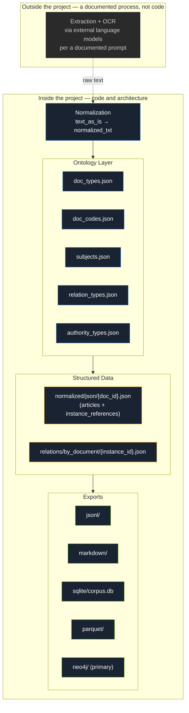
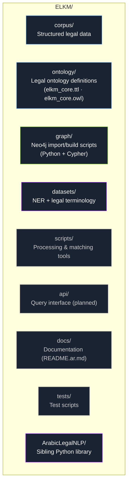
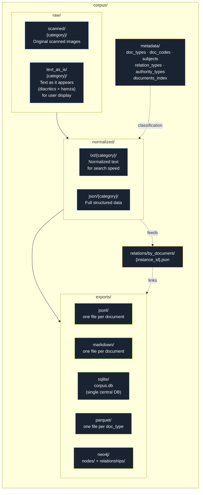
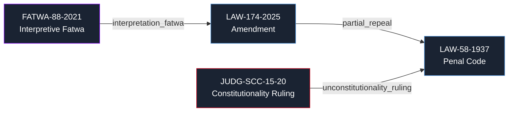

# ELKM — Egyptian Legal Knowledge Model

<div align="center">

**The first comprehensive, open-source Arabic legal knowledge graph for Egyptian law**

[](https://opensource.org/licenses/MIT)
[](https://creativecommons.org/licenses/by/4.0/)
[](https://www.python.org/)
[](https://neo4j.com/)
[]()
[](https://github.com/heshammalek/ELKM-Egyptian-Legal-Knowledge-Model/actions)

**[نسخة عربية ستكون متاحة في `docs/README.ar.md` (قيد الإعداد)](docs/README.ar.md)**

</div>

---

## 📑 Table of Contents

- [Why ELKM?](#why-elkm)
- [Quick Start](#-quick-start-tldr)
- [Core Challenges](#core-challenges)
- [The Academic Gap](#the-academic-gap)
- [Why ELKM Is Different](#why-elkm-is-different-competitive-context)
- [Project Scope](#project-scope-where-the-code-ends)
- [Repository Structure](#repository-structure)
- [Corpus Structure](#corpus-structure-corpus)
- [Relationship Graph](#relationship-graph)
- [Segmented Identifier System](#segmented-identifier-system)
- [Technical Stack](#technical-stack)
- [Intellectual References](#intellectual-references)
- [Current Status](#-current-status)
- [Roadmap](#roadmap)
- [How to Contribute](#-how-to-contribute)
- [Call for Collaboration](#call-for-collaboration)
- [Acknowledgments](#-acknowledgments)
- [License](#license)

---

## Why ELKM?

The first Arabic attempt to build a knowledge graph and ontology for the legal domain — a pioneering scientific, technical, and economic project.

### Scientific Value

The first comprehensive, open-source Arabic legal ontology. No equivalent currently exists. Existing efforts are limited to term lists without relationships, or theoretical papers never implemented in software. ELKM builds a **knowledge base** — not a text archive. The difference: an archive answers *what*; a knowledge base answers *why*.

### Technical Value

A **knowledge graph** connecting every legal text to everything that affected it or was affected by it, with full temporal tracking per article. This enables queries that are **impossible** in any text search engine or relational database:

- **Time-Travel**: Retrieve the text of an article as it stood on a specific historical date.
- **Multi-hop Impact**: Trace the final effect on Article X after a chain of amendments, rulings, and administrative decisions.
- **Dependency Map**: Find every text that cites a specific constitutional article.
- **Principle Tracking**: Trace how a legal principle evolved across decades of legislation.
- **Legislative Cycles**: Detect principles ruled unconstitutional and later re-enacted in new laws.

### Economic Value

Once interfaces are built, ELKM serves multiple roles: individuals, professionals, research institutions, and authorities. The model: **ELKM open-source** (knowledge layer) → **LexChain Egypt** (commercial product layer).

### Why Now — Data Is the Differentiator

When LLMs (GPT, Claude, Gemini) and infrastructure (Neo4j, AWS, Qdrant) converge, **the only remaining differentiator is data quality and structure**.

VentureBeat Pulse (June–July 2026, 101 companies):

- **57%** of companies reported "confident but wrong" AI agent answers due to missing or inconsistent context
- Rose to **68%** in July
- Companies with **governed context layers** reported *higher* error rates (78% vs 20%) — not because their systems are worse, but because they **see** errors that were previously invisible

**The problem is not the model — it is the data.** ELKM is the layer for Egyptian law.

### Why Egypt

A unique hybrid: Islamic Sharia, French civil tradition, judicial precedent, State Council fatwa, and the Supreme Constitutional Court. No off-the-shelf Western ontology fits. The only path is purpose-built.

### Global Momentum

Legal tech investment in 2025 exceeded **$5.99 billion**, up 22% year-over-year, with 14 rounds above $100M. Harvey AI raised $818M (valuation $8B). Clio raised $850M and acquired vLex for $1B. ELKM builds this layer for Egyptian law — **before anyone else does**.

### The Egyptian Gap

Egypt's Supreme Committee for Legislative Reform and National AI Council have made progress. The Egyptian Legal Portal holds 290,000+ laws and 100,000+ judgments. But it remains an **archive**, not a **knowledge layer**. ELKM fills this gap.

---

## 🚀 Quick Start (TL;DR)

```bash
# Clone the repo
git clone https://github.com/heshammalek/ELKM-Egyptian-Legal-Knowledge-Model.git
cd ELKM-Egyptian-Legal-Knowledge-Model

# Set up Python environment
python -m venv venv
source venv/bin/activate  # On Windows: venv\Scripts\activate
pip install -r requirements.txt
```

> The unified export/build script is still under active development (see [Current Status](#-current-status)) — exact commands and paths will stabilize as `scripts/` is finalized.

---

## Core Challenges

| # | Challenge | Detail |
|---|-----------|--------|
| 1 | **No unified relational structure** | Egyptian laws interweave through total/partial repeal, amendment, addition, and delegation — with no structured, programmatically queryable source linking them |
| 2 | **Overlapping document types** | Laws, decree-laws, administrative decisions, legislative fatwas, judicial rulings, parliamentary minutes — each with different force logic, statuses, and issuing authorities, and easy to misclassify (e.g. every decree-law is titled "Presidential Decision," but not every presidential decision is a decree-law) |
| 3 | **Arabic legal-text complexity** | Diacritics, hamza variants, Arabic-Indic vs. Western numerals, legal tables — and hyper-precision at the character level, as in the passive/active distinction above |
| 4 | **The temporal dimension of force** | The same article can be in force, then suspended, then amended, then ruled unconstitutional — each state with its own independent start and end date, requiring precise tracking rather than a single snapshot |
| 5 | **Repeal vs. nullity vs. lapse** | Ending a text's effect doesn't always follow the same logic: prospective repeal, retroactive erasure, nullity from a fundamental defect, or automatic lapse (a decree-law not submitted to parliament within the constitutional deadline) — distinctions most legal archives ignore entirely |
| 6 | **Massive scale, scattered sources** | Thousands of documents spanning decades, from fragmented paper and digital sources, requiring a scalable data architecture instead of unstructured manual processing |
| 7 | **Colliding issuing authorities** | Entirely different administrative decisions can share the same number and year if issued by different authorities (a minister vs. a governor vs. an agency head) — without a structured authority registry, identifier collisions are inevitable |

---

## The Academic Gap

No comprehensive, publicly published Arabic legal ontology currently exists. Existing efforts are limited to digital legal dictionaries (term lists without relationships), incomplete research papers never implemented in software, or Western ontologies (FOLaw, LKIF, UFO-L) that don't map onto the Egyptian system.

**ELKM-Ontology** aims to be the first comprehensive, publicly published Arabic legal ontology — a scholarly contribution in its own right, publishable at venues such as **ICAIL** (International Conference on AI and Law), **JURIX**, and **LREC**. Concretely, ELKM aims to contribute:

1. The first comprehensive Arabic legal ontology.
2. A model for representing Arabic legal text as a knowledge graph.
3. A bridge between global standards and the Arabic legal context.
4. An Arabic legal Named Entity Recognition (NER) model.

### Why Egypt Specifically

The Egyptian legal system is a unique hybrid unlike any single reference model:

- **Islamic Sharia** — a principal source of legislation (Article 2 of the Constitution)
- **French civil law tradition** — underlying the civil and commercial fabric
- **Judicial precedent** — the Court of Cassation plays a broader interpretive role than its French counterpart
- **State Council fatwa** — a purely Egyptian institution with no Western equivalent
- **The Supreme Constitutional Court** — exercising posterior review of legislative constitutionality

Any off-the-shelf Western ontology collides with this specificity. The only viable path is a purpose-built one.

---

## Why ELKM Is Different (Competitive Context)

Products already exist offering fast full-text search over Egyptian legislation — most notably **Ansvar Systems** (Sweden), a globally leading company running the same MCP-server template across 46 jurisdictions (330,000+ national laws). The real difference isn't coverage — it's the **layer**:

| | Traditional full-text search tools | ELKM |
|---|---|---|
| **Structure** | Simple text indexing (FTS5 + BM25) | Ontology + graph + explicit relationships |
| **Depth** | Generic classification | Distinguishes decree-law from administrative decision, fatwa binding basis (Art. 66), per-article status over time |
| **Scope** | Usually statutes only | 12 document types (including rulings, fatwas, minutes, academic doctrine) |
| **Temporal** | Current snapshot only | Time-Travel queries: retrieve any article as it stood on any historical date |
| **AI-Ready** | Unstructured text | Structured, contextual data designed for AI reasoning |
| **Nature** | Horizontal expansion (breadth) | Vertical depth in one legal system (depth) |

ELKM operates on a different layer — not by competing on text search, but by building a deeper one (legal reasoning and a relationship graph) for which no real equivalent currently exists for Egyptian law. Tools like Harvey AI and CoCounsel demonstrate the same lesson from the other direction: powerful LLMs still need a structured knowledge base underneath them to reason reliably over law. ELKM aims to be that base — an open infrastructure of the kind Westlaw provides commercially, but published.

---

## Project Scope: Where the Code Ends

The **extraction and OCR** stage (converting image/PDF to text) runs through external language models following a documented extraction prompt, **entirely outside the project's codebase**. This is deliberate: ELKM's real value lies in the data architecture, ontology, relationship layer, and graph engine — not in an OCR engine that's replaceable by any newer model. Keeping extraction separate keeps the repo focused, lightweight on dependencies, and clear in scope for any contributor or reviewer.



---

## Repository Structure



### `datasets/ner/` — Detailed Layout

```
datasets/ner/
├── readme.md
├── schema.json              Label definitions: LAW_REF, ARTICLE_REF, COURT,
│                             AUTHORITY, DATE_HIJRI_GREGORIAN, PENALTY,
│                             MONETARY_AMOUNT, LEGAL_PERSON
├── annotated/
│   ├── train.conll           80%
│   ├── dev.conll             10%
│   └── test.conll            10%
├── exports/
│   ├── ner.jsonl              HuggingFace format
│   └── ner.conll
└── legal-terms/               Legal terminology glossary for annotation
                                consistency (e.g. relative vs. absolute
                                nullity, civil vs. criminal effect of an
                                unconstitutionality ruling, imprisonment
                                vs. detention vs. hard labor) — a
                                disambiguation reference for annotators,
                                not general documentation, to prevent
                                inconsistent labeling across the dataset
```

The `NER_EXTRACTOR` and `ANNOTATION_HELPER` scripts read directly from `corpus/normalized/{type}/json` — never re-reading raw scans, to avoid duplicated work. Until a trained model exists, the MVP fallback is a set of regex rules grounded in a documented Arabic legal-drafting grammar (conditional sentences, cross-references, definitions, enumerations, issuing-authority attribution).

**ArabicLegalNLP** — a standalone sibling Python library for Arabic legal NLP (legal thesaurus, morphological analysis, agent/patient extraction, NER), called by ELKM as an external tool rather than built into it. It exists to defend Arabic linguistic specificity in the legal domain, developed as its own project on its own timeline.

---

## Corpus Structure (`corpus/`)



**Design rationale:**

- **`raw/scanned/{category}/`** and **`raw/text_as_is/{category}/`**: a unified category split that repeats identically inside `normalized/` — knowing a document's path in one folder tells you its path everywhere else instantly.
- **`text_as_is`** is a verbatim copy (the *Display Path*) for direct user display; **`normalized`** is a simplified copy (the *Search Path*) for **faster search and matching**, not display.
- **`metadata`**: near-static classification data — document types, authority codes, subject sectors, relation types, authority types, and the document index.
- **`relations/by_document/`**: every relation is stored as a separate JSON file keyed by its `instance_id`, and referenced directly from within the article it connects via `instance_references`.
- **`exports/`**: a fully derived layer with storage granularity that differs by format — **jsonl/markdown** one file per document, **sqlite** a single central database (`INSERT OR REPLACE` keyed by `doc_id` to prevent duplication), **parquet** one file per `doc_type` (a columnar format unsuited to thousands of small files), and **neo4j** as the primary output, with `nodes/` and `relationships/` for import.

### Article Index = the SQLite Export, Not a Separate File

With thousands of documents and hundreds of thousands of articles, a single `documents_index.json` becomes too heavy for article-level queries. The fix: an `articles_index` table inside the same SQLite export serves both purposes:

```sql
CREATE TABLE articles_index (
  doc_id TEXT, article_number INTEGER, doc_type TEXT,
  subjects TEXT, -- JSON array as text
  text_normalized TEXT
);
```

This is the direct foundation for queries like *"which articles reference Article 53 of the constitution"* as a single query, and it's the same foundation the future Dependency Map will be built on.

---

## Relationship Graph



Every relation is recorded with full temporal and legal precision: relation type, effective date, extraction confidence level, and the relation's own status. This distinguishes **prospective repeal** from **retroactive erasure** from **nullity** — distinctions most traditional legal archives ignore entirely.

Named relation types anchor the graph's semantics, mirroring the authorities that create legal truth:

| Relation | Meaning |
|---|---|
| `total_repeal` | Complete repeal of a law by a later law |
| `partial_repeal` | Repeal of a specific article or provision |
| `amendment` | Modification of an existing legal text |
| `addition` | Addition of new articles to an existing law |
| `unconstitutionality_ruling` | Supreme Constitutional Court ruling of unconstitutionality |
| `interpretation_fatwa` | Interpretive fatwa from the State Council |
| `referral` | Cross-reference from one text to another |
| `establishes` | Creation of a new entity or institution |

**Time-Travel queries** — retrieving the law exactly as it stood on a specific historical date — are a first-class capability the graph is designed to support, not an afterthought.

**Dependency Map** — *"which laws cite Article 53 of the constitution?"* — isn't a separate component, but a direct result of applying the NER model (specifically the `ARTICLE_REF` label) across the entire corpus to extract every explicit reference to one article inside another document's text, then building the graph from it.

---

## Segmented Identifier System

Every document gets a unique, human-readable, automatically generable identifier:

```
LAW-10-2000                     Law No. 10 of 2000
DL-20-2001                      Decree-Law No. 20 of 2001
ADM-PRES-30-2025                Presidential Decision No. 30 of 2025
ADM-MIN-AGRIC-5-2024            Minister of Agriculture Decision No. 5 of 2024
JUDG-SCC-15-20                  Supreme Constitutional Court, Case 15 / Judicial Year 20
JUDG-CASS-CIV-30-40             Court of Cassation, Civil Chamber, Appeal 30 / Judicial Year 40
```

`metadata/doc_codes.json` is a living, non-exhaustive registry of authorities and courts, holding **the identifier construction pattern itself** alongside it (segment order, which courts require a chamber code) — kept in one file as a single source of truth used by both the extraction prompt and any validation script, rather than separate documentation that risks drifting out of sync. The practical necessity of the registry: entirely different administrative decisions can share the same number and year if issued by different authorities (a minister vs. a governor), so distinguishing by authority is mandatory to avoid identifier collisions.

---

## Technical Stack

| Component | Technology | Role |
|---|---|---|
| Language | **Python 3.12+** | Core implementation language |
| Graph database | **Neo4j 5.x** | Stores and queries multi-hop relationships between texts, via Cypher |
| Vector search | **Qdrant** | Semantic/vector search over legal text (folder reserved; not yet exported) |
| Text search & indexing | **SQLite (central) + Elasticsearch** | Queryable document/article index, plus fast full-text search on normalized text |
| Arabic NLP | **CAMeL Tools 1.5+** | Morphological analysis, POS tagging, NER |
| Ontology | **OWLReady2**, exported as OWL/Turtle (W3C-compatible) | doc_types.json / doc_codes.json / subjects.json / relation_types.json / authority_types.json define the applied classification (12 document types, 6 subject sectors) |
| Backend (planned) | **FastAPI** | Public API, data snapshots, or institutional integration |
| Containers & CI | **Docker + Compose, GitHub Actions, Pytest** | Reproducible environment, automated testing |
| LLM integration | **Anthropic/OpenAI SDKs directly** | Reasoning layer on top of the graph |

---

## Intellectual References

ELKM draws on academic, technical, and conceptual references — none adopted wholesale, each informing a specific design decision.

**Academic & Conceptual**

- **Harvard LIL** — document assembly line approach
- **Stanford CODEX** — "computable law" concept
- **Hohfeld** — legal relationship taxonomy
- **McCarty's LLD** — formal representation of legal norms
- **LKIF Core Ontology** — legal ontology approach (not its structure; incompatible with the Egyptian system)

**Standards & Frameworks**

- **Akoma Ntoso** — hierarchical document structure (concept, not standard)
- **LegalRuleML** — logical rule representation (concept, not format)
- **FOLaw** — legal ontology as a layer separate from text

**Technical Models**

- **Ansvar Systems** — full-text search is not enough; a deeper layer is needed
- **Harvey AI, CoCounsel** — LLMs need a structured knowledge base underneath

**Arabic Legal Ontologies (Prior Work)**

- **CrimAr (2017)** — Arabic legal ontology is possible, but narrow
- **Zaidi (2006)** — Arabic legal search needs semantic expansion

**Egyptian Legal Archives**

- **Manshurat (AUC)** — digital archives are a foundation, not an endpoint

---

## 📊 Current Status

> Indicative status — checkboxes will be updated as work progresses.

| Component | Planned | In Progress | Complete |
|---|---|---|---|
| Core Ontology | ⬜ | ⬜ | ⬜ |
| Corpus Architecture | ⬜ | ⬜ | ⬜ |
| Segmented Identifier System | ⬜ | ⬜ | ⬜ |
| Neo4j Import Script | ⬜ | ⬜ | ⬜ |
| Unified Export Script | ⬜ | ⬜ | ⬜ |
| NER Dataset | ⬜ | ⬜ | ⬜ |
| Public API | ⬜ | ⬜ | ⬜ |
| Arabic Documentation | ⬜ | ⬜ | ⬜ |

---

## Roadmap

**Corpus & Core Architecture**
- [ ] Build the core ontology (document types, subject sectors)
- [ ] Design the corpus architecture (raw / normalized / metadata / relations / exports)
- [ ] Segmented identifier system
- [ ] Complete extraction of the core body of laws in force
- [ ] Build out the full relationship layer and link it to Neo4j
- [ ] Unified export script (read JSON → automatically route to jsonl/markdown/sqlite/parquet/neo4j by `doc_type`)
- [ ] EBNF grammar for Arabic legal drafting patterns, and a regex-based MVP entity extractor grounded in it

**Enrichment & Analysis**
- [ ] Enrichment pass: classify each article by subject via `subjects.json`
- [ ] Dependency Map via NER `ARTICLE_REF` extraction
- [ ] Time-Travel query support (retrieve the law as it stood on a given date)

**Arabic Legal NER**
- [ ] Finalize the `schema.json` label definitions
- [ ] Build `NER_EXTRACTOR` and `ANNOTATION_HELPER`
- [ ] Annotate a training set (train/dev/test) and export in HuggingFace and CoNLL formats
- [ ] Research paper on the Arabic Legal NER dataset

**Infrastructure**
- [ ] MCP server on top of ELKM
- [ ] Docker containers
- [ ] GitHub repository setup and linking
- [ ] CI pipeline

**After Corpus Completion**
- [ ] Full ontology and methodology documentation, published as OWL/Turtle
- [ ] Public query interface (API / semantic search)
- [ ] **ArabicLegalNLP** — standalone Python library
- [ ] **LexChain Egypt** — commercial product layer

---

## 🤝 How to Contribute

1. Fork the repository
2. Create a feature branch (`git checkout -b feature/amazing-feature`)
3. Commit your changes (`git commit -m 'Add some amazing feature'`)
4. Push to the branch (`git push origin feature/amazing-feature`)
5. Open a Pull Request

See `CONTRIBUTING.md` for detailed guidelines.

---

## Call for Collaboration

ELKM is building the **knowledge layer for Egyptian law** — the infrastructure that every legal AI application in Egypt will depend on. This is not just a research project; it is the foundation for a new generation of legal technology.

We are seeking partners who share this vision:

### For Academic Institutions

**What you get:**
- A pioneering research project publishable at **ICAIL**, **JURIX**, and **LREC**
- Graduate research opportunities in Arabic legal NLP and knowledge graphs
- The first published Arabic legal ontology — a scholarly contribution

**What you give:**
- Academic supervision of the ontology and methodology
- Publication support and peer review
- Graduate students to help build the corpus.
- 
- ### 💰 Funding
A seed grant would allow ELKM to move from prototype to a fully functional, published resource. Funding would cover:
- **Dedicated research time** for the project lead and research assistants.
- **Server and infrastructure costs** for Neo4j, PostgreSQL/Qdrant, and Elasticsearch.
- **Conference publication fees** (ICAIL, JURIX, LREC).
- **Annotation costs** for the Arabic Legal NER dataset.
- **Legal review fees** for expert validation of the ontology.
- **Establishment of a research entity** dedicated to the project.
- **Office setup and logistics** for the research team.

- ### For Technical and Legal Experts
As the project scales, we will need specialized expertise in areas such as:
- **Arabic NLP**
- **LLM Engineering**
- **Security**
- **Legal review** — judges, lawyers, and law professors to validate the ontology and the correctness of the relationships

If any of this fits what you do, opening an issue or reaching out is welcome.

---

## 🙏 Acknowledgments

- **Harvard LIL** for the Caselaw Access Project inspiration
- **CAMeL Lab** for Arabic NLP tools
- All contributors and reviewers who helped shape this project

---

## License

- **Code**: [MIT License](https://opensource.org/licenses/MIT)
- **Data**: [CC BY 4.0](https://creativecommons.org/licenses/by/4.0/)

Fully open to the legal and technical community — contributions and reviews welcome.

---

<div align="center">

**"Egyptian law, mapped from enactment to the latest amendment."**

</div>
